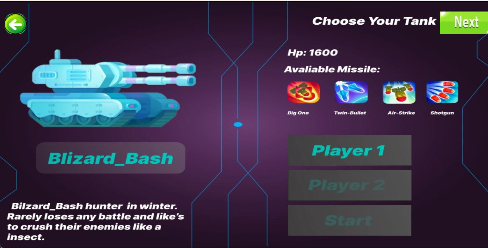
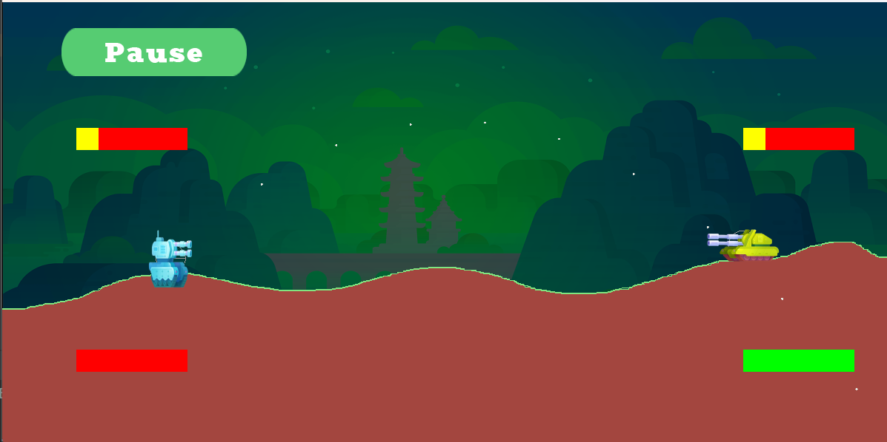

# Two-Player Tank Battle Game

## Overview

Implemented a two-player (1 vs 1) game mode where players face off on hilly terrain, taking turns firing bombs at one another. Players get a limited fuel ration per turn, are allowed to position themselves for a better shot, and must shoot at one another until one of their tanks is destroyed. 

Extended the scope of the game by creating vector-based animations and enforcing closely replicated game physics.

## Tech Stack

- **Java**
- **LibGDX**

## Features

- **Two-Player Mode**: Engage in a 1 vs 1 battle.
- **Hilly Terrain**: Dynamic and challenging landscapes.
- **Turn-Based Gameplay**: Players alternate turns to fire and reposition.
- **Limited Fuel**: Strategy required for positioning and movement.
- **Vector-Based Animations**: Smooth and visually appealing animations.
- **Game Physics**: Realistic physics for bomb trajectory and tank movement.

## Screenshots of Game:

